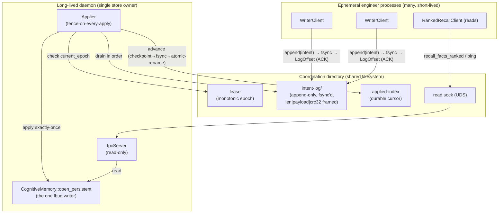

# Multi-Writer Coordination Layer (Design C)

The `coord` module is a **transactionally-safe, multi-writer coordination layer**
that sits over the single-writer `lbug` cognitive store. It lets many processes —
one long-lived daemon plus an unbounded, unpredictable population of ephemeral
"engineer" worker processes — persist knowledge into **one** durable shared store
without ever corrupting it and without ever losing an acknowledged write.

It is the Rust implementation of **Design C**, the design that was **formally
verified with TLA+** before a line of it was written. The specifications in
[`specs/`](../../../specs/README.md) are the source of truth; every public
guarantee on this page is pinned to a model-checked invariant, and the
`tla-model-check` CI gate fails the build if the design ever regresses.

- **Durable-log first.** A write is acknowledged the instant it is `fsync`'d into
  an append-only shared log. After that ack the submitting process may die
  immediately with **zero** lost writes.
- **Single fenced applier.** Exactly one applier — run by the daemon — drains the
  log **in order** and applies each intent to the `lbug` store **exactly once**.
  The store is always an in-order prefix of the log.
- **Epoch fencing, not `kill(pid,0)`.** Store ownership is decided by a
  **monotonic epoch token** carried in an on-disk lease, never by process
  liveness. This removes the split-brain hazard that `kill(pid, 0)` liveness reaps
  admit.
- **Read plane over IPC.** Reads (ranked recall, ping) are served over a Unix
  domain socket by the single daemon that owns the store. Consumers never open
  `lbug` directly — not to write, not to read.
- **No new dependencies, no Python, no network surface.** Everything is local
  files and a UDS. The trust boundary is the OS filesystem UID.

---

## Table of contents

1. [When to use it](#when-to-use-it)
2. [The problem it solves](#the-problem-it-solves)
3. [Architecture](#architecture)
4. [Cargo features](#cargo-features)
5. [Configuration and on-disk layout](#configuration-and-on-disk-layout)
6. [Concepts and guarantees](#concepts-and-guarantees)
7. [Public API](#public-api)
   - [`WriterClient` — appending write-intents](#writerclient--appending-write-intents)
   - [`WriteIntent` — the mutation surface](#writeintent--the-mutation-surface)
   - [`LogOffset`](#logoffset)
   - [`Lease` and `Epoch`](#lease-and-epoch)
   - [`Applier` — the single fenced consumer](#applier--the-single-fenced-consumer)
   - [`IpcServer` and `RankedRecallClient` — the read plane](#ipcserver-and-rankedrecallclient--the-read-plane)
   - [Daemon surface — `run_applier` / `serve_reads`](#daemon-surface--run_applier--serve_reads)
8. [Errors](#errors)
9. [Security model](#security-model)
10. [Tutorials](#tutorials)
    - [Engineer (writer) process](#tutorial-1-an-engineer-writer-process)
    - [Daemon (applier + read server)](#tutorial-2-the-daemon-applier--read-server)
    - [Read client](#tutorial-3-a-read-client)
11. [Adopting the layer in Simard](#adopting-the-layer-in-simard)
12. [Invariant → spec map](#invariant--spec-map)
13. [Compatibility and guarantees](#compatibility-and-guarantees)

---

## When to use it

| You want to… | Use |
|--------------|-----|
| Persist a store mutation from a short-lived process that may be killed at any moment | [`WriterClient::append`](#writerclient--appending-write-intents) |
| Own the `lbug` store from a long-lived daemon and apply the shared log to it | [`Applier`](#applier--the-single-fenced-consumer) via [`Coordinator::run_applier`](#daemon-surface--run_applier--serve_reads) |
| Serve reads from the daemon-owned store to other processes | [`IpcServer`](#ipcserver-and-rankedrecallclient--the-read-plane) via [`Coordinator::serve_reads`](#daemon-surface--run_applier--serve_reads) |
| Read ranked recall results from a consumer process without opening `lbug` | [`RankedRecallClient`](#ipcserver-and-rankedrecallclient--the-read-plane) |
| Own the store in-process (the daemon's single writer) | the existing `CognitiveMemory::open_persistent` (see the crate [`README`](../README.md)) — unchanged |

**Do not** call `CognitiveMemory::open_persistent` from anything other than the one
daemon that owns the store. That is exactly the direct-open the coordination layer
exists to replace. A consumer build that enables only the `coord` feature
**cannot name** `open_persistent`; this is enforced at compile time (see
[Cargo features](#cargo-features)).

---

## The problem it solves

`lbug` is **single-process-exclusive for writes** — only one OS process may hold
the writable database at a time. Two hazards fall out of a multi-writer world:

1. **Split-brain writes.** The pre-Design-C code reaped a "stale" open-lock when
   `kill(pid, 0)` reported the recorded PID dead. PID liveness is **not** lock
   ownership: under PID reuse, or an alive-but-paused holder, the reaper steals the
   lock while the real holder is still running. Two writers then open the store at
   once → WAL/catalog corruption → the "memory-wipe" recovery path. TLC reproduced
   this split-brain formally (`FencedApplier.tla`, `Fencing = FALSE`).

2. **Lost ephemeral writes.** An engineer's learnings must survive the reaping of
   its worktree. Any design where a write is durable only *inside* the engineer's
   own local store loses that write if the engineer dies before consolidating. TLC
   proved the federated design B loses acked writes (`FederatedLoss.tla`).

Design C avoids both, provably: durability is decoupled from application. The
append to the durable shared log is the ack, so durability no longer depends on any
ephemeral process staying alive; and single-writer safety is enforced by the epoch
fencing token, so it no longer depends on `kill(pid, 0)`.

---

## Architecture



The **write plane** (left) and the **read plane** (bottom) never touch `lbug`
directly. Only the daemon's `Applier` writes, and only the daemon's `IpcServer`
reads, from the single `open_persistent` handle.

---

## Cargo features

The layer is delivered as a new `coord` module gated by feature flags so that a
consumer process can link the writer/read client **without** linking the `lbug`
engine at all.

| Feature | Pulls in | Enables |
|---------|----------|---------|
| `coord` | (no `lbug`) | `Lease`/`Epoch`, `intent_log`/`WriteIntent`, `WriterClient`, `RankedRecallClient`. The full **consumer** surface. |
| `ipc` | `serde_json` (already present) | `RankedRecallClient` read transport; on the server side requires `persistent`. |
| `persistent` | `lbug` | The daemon-only pieces: `Applier`, `IpcServer`, `Coordinator::run_applier`/`serve_reads`, and `CognitiveMemory::open_persistent`. |

**Compile-time enforcement of "no engineer direct-open".** The `coord` feature
builds **standalone**, without `persistent`. In a `--features coord` (no
`persistent`) build, `open_persistent`, the `lbug` backend, and the `Applier` are
**not compiled in and cannot be named**. An engineer binary therefore *cannot*
open the store even by mistake — the type simply does not exist in its build.
CI builds the feature matrix (`--features coord` alone, `--features coord,ipc`,
`--features persistent`) plus `clippy -D warnings` on each, and the
`no_direct_open` test asserts the coord-only build cannot reference `lbug`.

```toml
# Engineer / consumer process: writer + read client, no lbug engine.
amplihack-memory = { version = "0.4", features = ["coord", "ipc"] }

# Daemon: owns lbug, runs the applier and the read server.
amplihack-memory = { version = "0.4", features = ["coord", "ipc", "persistent"] }
```

---

## Configuration and on-disk layout

All coordination state lives under a single **coordination directory**, described
by `CoordConfig`. It defaults to `<store>.coord` — a sibling of the store, *not* a
child. The `lbug` persistent store is a single file at `<store>`, so the
coordination directory **must** sit beside it (a child path would be destroyed the
moment `open_persistent` creates the store file). `<store>.coord` is still
discoverable next to the store it coordinates, sorts alongside `lbug`'s own
`.wal`/`.corrupt-*` sidecars, is shared across every participating process, and is
captured by an ordinary store-directory backup.

```rust
use amplihack_memory::coord::CoordConfig;
use std::path::PathBuf;

// Default: <store>.coord  (sibling of the store file, e.g. /var/lib/simard/memory.coord)
let cfg = CoordConfig::for_store("/var/lib/simard/memory");

// Or point at an explicit directory.
let cfg = CoordConfig {
    base_dir: PathBuf::from("/var/lib/simard/memory.coord"),
    ..CoordConfig::default()
};
```

### Directory layout

```
<store>.coord/                 # 0o700, created race-free (O_CREAT|O_EXCL)
├── lease                      # 0o600  monotonic epoch + holder record (fenced)
├── intent-log/                # 0o700  append-only durable log, segmented
│   ├── 000000000000.seg       # 0o600  64 MiB segments, len|payload|crc32 frames
│   ├── 000000000001.seg
│   └── ...
├── applied-index              # 0o600  durable applier cursor (LogOffset)
└── read.sock                  # 0o600  UDS read transport (SO_PEERCRED gated)
```

| Config field | Default | Meaning |
|--------------|---------|---------|
| `base_dir` | `<store>.coord` | Root of the coordination directory (sibling of the store file). |
| `segment_bytes` | `64 MiB` | Max size of an intent-log segment before rollover. |
| `socket_name` | `read.sock` | Fixed UDS filename under `base_dir`. |
| `max_frame_bytes` | `16 MiB` | Hard cap on a single log record / IPC frame (hostile-input defence). |
| `fsync_on_append` | `true` | Whether `append` `fsync`s before returning. **Leave on** — this is the durability ack. |

> **Shared-filesystem requirement.** Every participating process must see the same
> `base_dir` on a filesystem that honours `flock` and `fsync` (a local disk, or a
> POSIX-correct shared mount). The layer **fails closed** if `base_dir` is missing
> or unreadable; there is deliberately **no** per-agent fallback store (that would
> be design B, which loses writes).

---

## Concepts and guarantees

| Concept | What it is | Backing invariant |
|---------|-----------|-------------------|
| **Durable ack** | `WriterClient::append` returns a `LogOffset` **only after** the record is `fsync`'d into the log. | `NoLostAckedWrite` (`DurableLog.tla`) |
| **Total order** | The log is a single append-only total order; the applier consumes it strictly in order. | `PrefixConsistency` (`DurableLog.tla`) |
| **Exactly-once apply** | Each intent is applied to `lbug` once — no gaps, no reorder, no duplicates. Enforced by a durable applied-index and idempotent replay keyed by `intent_id`. | `PrefixConsistency` |
| **Epoch fencing** | Ownership = a monotonic `Epoch` in the `lease`. The applier stamps its epoch and **re-checks it before every apply**; a stale-epoch apply is rejected (`EpochFenced`). | `NoSplitBrain` (`FencedApplier.tla`) |
| **Fail-closed** | Missing/unreadable coord dir, torn interior record, epoch mismatch, or unknown intent version → hard error, never silent data loss or a bypass. | all three |

### Durability semantics — the ack point

`append` performs: frame the record (`len | payload | crc32`) → `write` with
`O_APPEND` under a **brief** `flock` → **`fsync`** → return `LogOffset`. The
`fsync` is the durability boundary. **After `append` returns, the submitting
process may crash, be `SIGKILL`ed, or have its worktree destroyed — the write is
already durable and will be applied by the daemon.** This is exactly the
`durable-log-survives-writer-death-after-ack` guarantee.

The `flock` around the append is a **short serialization primitive for the write
syscall only** — it is emphatically **not** store ownership. Ownership is the
epoch, full stop.

### Torn tail vs. committed-interior corruption

On reopen the log reader distinguishes two failure modes, and treats them
differently on purpose:

- **Torn tail** (a partial record at the very end, e.g. a crash mid-`append`): the
  incomplete tail is **quarantined and truncated**. That record was never acked,
  so dropping it is safe. This is the same crash-safe idiom as `lbug`'s WAL.
- **Committed-interior corruption** (a CRC mismatch on a record that is *not* the
  tail): this is a hard [`LogCorruption`](#errors) error — the applier **never**
  skips it, because skipping a committed record would violate `PrefixConsistency`.

### Compaction

Segments are 64 MiB. Once every record in a segment has been applied **and** the
applied-index has been durably advanced past it (checkpoint → `fsync` →
atomic-rename), the segment is safe to delete. Compaction never removes a segment
that holds an un-applied record.

> **Status.** Segmentation and rollover are implemented; *automatic* deletion of
> fully-applied segments is deferred (segments currently accumulate). The rule
> above defines exactly when a future compaction pass — or an operator — may
> safely remove a segment. Accumulation is not a correctness issue: the reader
> advances across segments and tolerates already-applied lower segments being
> absent.

---

## Public API

All types below live under `amplihack_memory::coord` and are re-exported from the
crate root. Availability by feature is noted per type.

### `WriterClient` — appending write-intents

*Feature: `coord`.* The consumer-side handle an engineer uses to append durable
write-intents. It links the coordination layer only; it **cannot** open `lbug`.

```rust
use amplihack_memory::coord::{CoordConfig, WriterClient, WriteIntent, LogOffset};

impl WriterClient {
    /// Connect to the coordination directory. Fails closed if the directory is
    /// missing or unreadable (no per-agent fallback store).
    pub fn connect(config: &CoordConfig) -> Result<WriterClient>;

    /// Append a pre-built intent (already carrying its `intent_id`) and return
    /// its durable offset. Returns **only after** the record is fsync'd — the ack.
    pub fn append(&self, intent: &WriteIntent) -> Result<LogOffset>;

    /// Convenience: assign a fresh v4 `intent_id`, append, and return both the
    /// offset and the id (so the caller can correlate the eventual apply).
    pub fn append_new(&self, intent: WriteIntent) -> Result<(LogOffset, uuid::Uuid)>;
}
```

`append` is **multi-process concurrent-safe**: any number of `WriterClient`s in
different processes may append at once. Records never interleave (length-framed +
`O_APPEND` + brief `flock`), and every acked record survives the writer's death
(`multi_process_concurrent_append` and `durable_log` tests).

`append` is **at-least-once** at the transport level and **exactly-once** at
apply, because the applier deduplicates by `intent_id`. Re-appending the *same*
`intent_id` (e.g. a writer that crashed uncertain whether its append landed) is
therefore safe: the applier applies it at most once.

### `WriteIntent` — the mutation surface

*Feature: `coord`.* A **versioned, `serde`-tagged** enum with one variant per
store mutation an engineer performs. Each variant carries an `intent_id: Uuid`
used for idempotent replay. It uses `deny_unknown_fields`; an unknown kind or
version **fails closed** (dropping an acked intent would break
`NoLostAckedWrite`).

```rust
#[derive(Debug, Clone, serde::Serialize, serde::Deserialize)]
#[serde(tag = "kind", rename_all = "snake_case")]
#[serde(deny_unknown_fields)]
pub enum WriteIntent {
    StoreFact {
        intent_id: Uuid,
        agent_name: String,
        concept: String,
        content: String,
        confidence: f64,
        source_id: String,
        tags: Option<Vec<String>>,
        metadata: Option<HashMap<String, serde_json::Value>>,
    },
    StoreProcedure {
        intent_id: Uuid,
        agent_name: String,
        name: String,
        steps: Vec<String>,
        prerequisites: Option<Vec<String>>,
    },
    StoreEpisode {
        intent_id: Uuid,
        agent_name: String,
        content: String,
        source_label: String,
        temporal_index: Option<i64>,
        metadata: Option<HashMap<String, serde_json::Value>>,
    },
    StoreProspective {
        intent_id: Uuid,
        agent_name: String,
        description: String,
        trigger_condition: String,
        action_on_trigger: String,
        priority: i32,
    },
    LinkFactToEpisodes {
        intent_id: Uuid,
        agent_name: String,
        fact_id: String,
        episode_ids: Vec<String>,
    },
    LinkSimilarFacts {
        intent_id: Uuid,
        agent_name: String,
        fact_id_a: String,
        fact_id_b: String,
        similarity_score: f64,
    },
    UpsertFact {
        intent_id: Uuid,
        agent_name: String,
        input: FactInput,
        options: StoreFactOptions,
    },
    RecordAccess {
        intent_id: Uuid,
        agent_name: String,
        node_id: String,
        kind: AccessKind,
    },
}
```

Each variant maps 1:1 to an existing `CognitiveMemory` mutator the applier calls
(all documented in the crate [`README`](../README.md)):

| `WriteIntent` variant | Applier calls |
|-----------------------|---------------|
| `StoreFact` | `store_fact` |
| `StoreProcedure` | `store_procedure` |
| `StoreEpisode` | `store_episode` |
| `StoreProspective` | `store_prospective` |
| `LinkFactToEpisodes` | `link_fact_to_episodes` |
| `LinkSimilarFacts` | `link_similar_facts` |
| `UpsertFact` | `upsert_fact` |
| `RecordAccess` | `record_access` |

> **`RecordAccess` is also how a read counts as an access.** Because the read
> plane never mutates the store, a consumer that wants a `recall_facts_ranked`
> to bump usage counters emits a `RecordAccess` intent on the write plane; the
> applier applies it durably and exactly-once. This keeps *all* store mutations —
> including access bookkeeping — on the single fenced write path.

> **Versioning & rollout.** The enum is versioned. When adding a variant, deploy
> the reader/daemon **before** any writer emits the new variant, so an older
> applier never meets an intent kind it must fail closed on. An unknown
> kind/version is a hard [`UnsupportedIntentVersion`](#errors) — never a silent
> skip.

### `LogOffset`

*Feature: `coord`.* An opaque, totally-ordered position in the durable log
(segment index + byte offset). Returned by `append`, persisted by the applier as
the applied-index, and monotonically increasing.

```rust
#[derive(Debug, Clone, Copy, PartialEq, Eq, PartialOrd, Ord, Serialize, Deserialize)]
pub struct LogOffset { /* opaque */ }
```

### `Lease` and `Epoch`

*Feature: `coord`.* The on-disk store lease. The `Epoch` is a **monotonic**
fencing token and the **sole** ownership signal. Acquiring or renewing the lease
bumps the epoch; `release` relinquishes it. `current_epoch` reads the live value
the applier fences against. **Liveness (`kill(pid, 0)`) is never used to decide
ownership.**

```rust
pub type Epoch = u64;

impl Lease {
    /// Acquire the lease, bumping the epoch. RMW under a brief flock (the flock
    /// serializes the update; it is *not* ownership — the epoch is).
    pub fn acquire(config: &CoordConfig, holder: &str) -> Result<Lease>;

    /// Renew the held lease (bumps the epoch again, extending fencing).
    pub fn renew(&mut self) -> Result<Epoch>;

    /// Release the lease.
    pub fn release(self) -> Result<()>;

    /// This lease's epoch.
    pub fn epoch(&self) -> Epoch;

    /// Read the current on-disk lease epoch without acquiring.
    pub fn current_epoch(config: &CoordConfig) -> Result<Epoch>;
}
```

The lease record is a fixed `magic | version | epoch | holder | crc32` layout,
created race-free with `O_CREAT | O_EXCL` at `0o600`.

### `Applier` — the single fenced consumer

*Feature: `persistent`.* The daemon-only consumer. It holds the store lease, opens
the single `lbug` writer via `open_persistent`, and drains the log in order. It
**re-reads `current_epoch` and fences before every apply**; if the live epoch no
longer matches its own (another process acquired the lease), the apply is rejected
with [`EpochFenced`](#errors) and the applier stops — it **fails closed** and never
"wins" by being alive. Progress is recorded exactly-once via the durable
applied-index (checkpoint → `fsync` → atomic-rename).

```rust
impl Applier {
    /// Acquire the lease, open the single lbug writer, and construct the applier.
    pub fn open(store_path: &Path, agent_name: &str, config: &CoordConfig) -> Result<Applier>;

    /// Apply all currently-durable log records at or after the applied-index,
    /// in order, exactly-once, fencing before each. Returns the number applied.
    pub fn drain(&mut self) -> Result<usize>;

    /// Block draining the log as records arrive until `shutdown` is signalled.
    pub fn run(&mut self, shutdown: impl Fn() -> bool) -> Result<()>;

    /// The applied-index (durable cursor) as last committed.
    pub fn applied_index(&self) -> LogOffset;
}
```

Exactly-once holds across daemon restarts: on reopen the applier resumes from the
durable applied-index and idempotently replays by `intent_id`
(`applier_exactly_once` test).

### `IpcServer` and `RankedRecallClient` — the read plane

*Server feature: `ipc` + `persistent`. Client feature: `ipc`.* A framed-JSON Unix
domain socket read transport. Reads are served from the single daemon-owned store;
the read plane is **read-only by contract** — no mutation op is accepted over it.

```rust
// Server side (daemon).
impl IpcServer {
    /// Bind read.sock (0o600, O_CREAT|O_EXCL, O_NOFOLLOW) under the coord dir.
    pub fn bind(config: &CoordConfig) -> Result<IpcServer>;

    /// Serve read requests against `memory` until `shutdown` is signalled.
    /// Every connection is UID-checked via SO_PEERCRED before any request.
    pub fn serve(&self, memory: &mut CognitiveMemory, shutdown: impl Fn() -> bool) -> Result<()>;
}

// Client side (consumer).
impl RankedRecallClient {
    pub fn connect(config: &CoordConfig) -> Result<RankedRecallClient>;

    /// Liveness/health probe. Round-trips a ping frame.
    pub fn ping(&self) -> Result<()>;

    /// Ranked recall over the daemon-owned store. `options.limit` is clamped
    /// and `options.record_access` is forced **off** server-side (the read
    /// plane never mutates the store); frames are size-capped. Returns scored
    /// facts, read-only.
    pub fn recall_facts_ranked(
        &self,
        query: &str,
        options: RecallOptions,
    ) -> Result<Vec<Scored<SemanticFact>>>;
}
```

See [Ranked Recall](ranked_recall.md) for the scoring model behind
`recall_facts_ranked`; the IPC path returns the identical `Scored<SemanticFact>`
shape, just served out-of-process.

> **Reads never mutate; access-recording flows through the write plane.** A local
> `recall_facts_ranked` call bumps `usage_count`/`last_accessed_at` when
> `RecallOptions.record_access` is `true` (the default) — that is a store
> *mutation*. Because the read plane is read-only by contract, the `IpcServer`
> **forces `record_access = false`** on every incoming request. Callers that want
> a recall to count as an access emit a separate
> [`WriteIntent::RecordAccess`](#writeintent--the-mutation-surface) on the write
> plane, so the bump is applied durably and exactly-once by the single fenced
> applier — never as a side effect of a read.

### Daemon surface — `run_applier` / `serve_reads`

*Feature: `persistent` (+ `ipc` for reads).* The `Coordinator` type is the
daemon's front door. `open_persistent` remains the single in-daemon store owner;
`Coordinator` wraps it with the applier and the read server.

```rust
use amplihack_memory::coord::{Coordinator, CoordConfig};

impl Coordinator {
    /// Construct the daemon coordinator over a store path + coord config. Opens
    /// the single lbug writer (open_persistent) and acquires the lease.
    pub fn open(store_path: &Path, agent_name: &str, config: CoordConfig) -> Result<Coordinator>;

    /// Run the fenced applier loop (drains the durable log into lbug).
    pub fn run_applier(&mut self, shutdown: impl Fn() -> bool) -> Result<()>;

    /// Serve ranked-recall/ping reads over read.sock (feature = "ipc").
    pub fn serve_reads(&mut self, shutdown: impl Fn() -> bool) -> Result<()>;
}
```

A typical daemon runs `run_applier` and `serve_reads` on two threads sharing the
one store owner; both go through the single `open_persistent` handle, preserving
single-writer discipline.

---

## Errors

The coordination layer adds three variants to `MemoryError` (see
[`errors.rs`](../src/errors.rs)) and reuses `Storage`, `InvalidInput`, and
`SecurityViolation`. All messages are **payload-free** (structural fields only) —
no user data ever appears in an error string or log line.

| Variant | Raised when | Fail mode |
|---------|-------------|-----------|
| `EpochFenced { expected, found }` | The applier's stamped epoch no longer matches the live lease epoch at apply time (another process took the lease). | Fail-closed. The applier stops; it never applies under a stale epoch. Guards `NoSplitBrain`. |
| `LogCorruption` | A CRC mismatch on a **committed interior** log record (not the tail). | Hard error, **never skipped** — skipping would break `PrefixConsistency`. |
| `UnsupportedIntentVersion` | A `WriteIntent` of an unknown kind or version is read. | Fail-closed — never dropped, to preserve `NoLostAckedWrite`. |

Other mappings:

- All raw I/O failures map to `MemoryError::Storage`.
- A UDS peer whose `SO_PEERCRED` UID does not match maps to
  `MemoryError::SecurityViolation`.
- A **torn tail** (partial final record) is **not** an error — it is quarantined
  and truncated, because it was never acked.

---

## Security model

The trust boundary is the **OS filesystem UID**, not application credentials.

- **Least-privilege, race-free permissions.** The coord dir is `0o700`; every
  file and the socket are `0o600`. They are created race-free with
  `O_CREAT | O_EXCL` (and the socket with `O_NOFOLLOW`) — permissions are set at
  creation, never `chmod`'d after the fact.
- **Peer authentication on reads.** The `IpcServer` checks `SO_PEERCRED` on every
  connection and rejects any UID mismatch with `SecurityViolation`. The read plane
  is **read-only by contract**: it accepts ranked-recall and ping only, never a
  mutation, and it forces `RecallOptions.record_access = false` so a read can
  never bump usage counters on the store.
- **Ownership by epoch, no bypass door.** Store ownership is authenticated solely
  by the monotonic epoch with fence-on-every-apply. There is **no** `kill(pid, 0)`,
  no `--admin`, and no `--no-verify`/bypass path.
- **Every byte is hostile input.** On-disk records and IPC frames are validated in
  a fixed order — **magic → length-cap → presence → CRC → decode** — bounding the
  length *before* allocating and verifying the CRC *before* deserializing.
  `WriteIntent` uses `deny_unknown_fields`; frame sizes are capped
  (`max_frame_bytes`); `RecallOptions.limit` is clamped and
  `RecallOptions.record_access` is forced `false` server-side; JSON depth is
  bounded.
- **Data protection scope.** `0o600` confidentiality + CRC integrity +
  `fsync`-anchored durability + payload-free errors. At-rest encryption and
  multi-tenancy are explicitly **out of scope**; there is no new network surface
  and no new dependency.

---

## Tutorials

### Tutorial 1: an engineer (writer) process

An ephemeral worker records a fact and a procedure, then exits immediately — the
writes are already durable.

```rust
use amplihack_memory::coord::{CoordConfig, WriterClient, WriteIntent};
use uuid::Uuid;

fn main() -> amplihack_memory::Result<()> {
    let cfg = CoordConfig::for_store("/var/lib/simard/memory");
    let writer = WriterClient::connect(&cfg)?;

    // Append a fact. Returns only after fsync — this is the durable ack.
    let (offset, id) = writer.append_new(WriteIntent::StoreFact {
        intent_id: Uuid::new_v4(),
        agent_name: "engineer-42".into(),
        concept: "build".into(),
        content: "cargo build --release is warning-clean on 1.85".into(),
        confidence: 0.95,
        source_id: "engineer-42".into(),
        tags: Some(vec!["build".into(), "toolchain".into()]),
        metadata: None,
    })?;
    println!("fact durable at {offset:?} (intent {id})");

    // Append a procedure derived from what we learned.
    writer.append(&WriteIntent::StoreProcedure {
        intent_id: Uuid::new_v4(),
        agent_name: "engineer-42".into(),
        name: "release-build".into(),
        steps: vec!["cargo fmt".into(), "cargo clippy -D warnings".into(),
                    "cargo build --release".into()],
        prerequisites: None,
    })?;

    // Safe to exit / be killed now: both writes are durable and will be applied
    // by the daemon's single fenced applier, in order, exactly once.
    Ok(())
}
```

Note there is **no** `open_persistent`, no local store, and no direct `lbug`
handle anywhere in an engineer. In a `--features coord` build those symbols do not
even exist.

### Tutorial 2: the daemon (applier + read server)

```rust
use amplihack_memory::coord::{Coordinator, CoordConfig};
use std::sync::atomic::{AtomicBool, Ordering};
use std::sync::Arc;
use std::thread;

fn main() -> amplihack_memory::Result<()> {
    let store = "/var/lib/simard/memory";
    let cfg = CoordConfig::for_store(store);

    // Opens the single lbug writer (open_persistent) and acquires the lease,
    // bumping the epoch. This daemon is now the sole store owner.
    let mut coord = Coordinator::open(store.as_ref(), "simard-daemon", cfg)?;

    let stop = Arc::new(AtomicBool::new(false));
    {
        let stop = stop.clone();
        // Applier thread: drains the durable log into lbug, fencing each apply.
        thread::spawn(move || {
            coord.run_applier(move || stop.load(Ordering::Relaxed)).unwrap();
        });
    }
    // Read-server thread would call coord.serve_reads(...) similarly.
    Ok(())
}
```

If a second process ever acquires the lease (bumping the epoch), this applier's
next fenced apply returns `EpochFenced` and it stops — split-brain is impossible.

### Tutorial 3: a read client

```rust
use amplihack_memory::coord::{CoordConfig, RankedRecallClient};
use amplihack_memory::cognitive_memory::RecallOptions;

fn main() -> amplihack_memory::Result<()> {
    let cfg = CoordConfig::for_store("/var/lib/simard/memory");
    let client = RankedRecallClient::connect(&cfg)?;

    client.ping()?; // health probe

    let hits = client.recall_facts_ranked(
        "release build toolchain",
        RecallOptions { limit: 10, ..Default::default() },
    )?;
    for h in hits {
        println!("{:.3}  {}", h.score, h.item.content);
    }
    Ok(())
}
```

---

## Adopting the layer in Simard

Simard's writer ladder and reaper are rewired to the coordination layer (a
separate PR that pins the merged lib revision):

- **Tier-2 direct-open is removed.** `src/memory_ipc/launcher.rs` tier-2 no longer
  calls `LibraryCognitiveMemory::open`; it appends the corresponding
  [`WriteIntent`](#writeintent--the-mutation-surface) via `WriterClient::append`.
  Ephemeral engineers **never** open `lbug` directly.
- **The `kill(pid, 0)` reaper is deleted.** `reap_stale_open_lock`, `is_pid_alive`,
  and `flock_held` (`src/memory_ipc/mod.rs`) are removed outright. Store-lease
  safety is now the lib's epoch fencing.
- **The daemon keeps tier-0 and tier-1.** Tier-0 is the in-process store owner and
  runs the `Applier`; tier-1 serves reads via `IpcServer`. The tier-1 fail-closed
  behaviour (#2896) and no-read-fallback contract (#1590) are preserved.

After the adoption merges: back up the store, redeploy the daemon on the new
binary, and verify (a) it is healthy, (b) engineers append via the log, and (c)
there are no tier-2 direct-opens and no lock-contention reaps.

---

## Invariant → spec map

| Guarantee here | TLA+ spec | Invariant/property |
|----------------|-----------|--------------------|
| No two epochs ever write the store (no split-brain) | [`FencedApplier.tla`](../../../specs/README.md) | `NoSplitBrain` (holds under `Fencing = TRUE`) |
| Store is always an in-order prefix of the log; exactly-once apply | [`DurableLog.tla`](../../../specs/README.md) | `PrefixConsistency` |
| Every acked (fsync'd) write is eventually applied, even if the writer dies | [`DurableLog.tla`](../../../specs/README.md) | `NoLostAckedWrite` |
| Per-agent stores lose acked writes (why we do **not** do that) | [`FederatedLoss.tla`](../../../specs/README.md) | `NoLostAckedWrite` **violated** (design B rejected) |

The `tla-model-check` CI gate runs all four checks (`specs/run-checks.sh`) on every
push. If the single-writer safety invariant regresses, or the rejected designs
silently become "safe", CI blocks the change. **Do not edit the `.tla` files to
make an implementation pass** — the specs are the source of truth.

---

## Compatibility and guarantees

- **Additive.** `CognitiveMemory::open_persistent` and every existing mutator/read
  API are unchanged in signature and behaviour. The coordination layer is a new,
  opt-in module behind the `coord`/`ipc`/`persistent` features.
- **Consumer builds cannot open the store.** A `--features coord` build has no
  `lbug`, no `open_persistent`, and no `Applier` — the direct-open path is
  impossible by construction, and CI asserts it (`no_direct_open`).
- **Durability contract.** A `LogOffset` returned by `append` is a promise: that
  intent is durable and will be applied exactly once, regardless of whether the
  writer survives.
- **Consistency model.** Reads observe the applied prefix (eventual consistency).
  Read-your-writes across the write plane and read plane is **not** provided in
  this version; a freshly appended intent becomes visible to reads once the applier
  has applied it.
- **No silent fallback, ever.** Missing coord dir, torn interior record, epoch
  mismatch, unknown intent version, or a failed peer-cred check all fail closed
  with a typed error — never a silent empty read, a bypass, or a per-agent store.

### Hermetic test coverage

| Test | Proves |
|------|--------|
| `lease_epoch_fencing.rs` | Epoch monotonicity; a stale-epoch apply is fenced (the split-brain repro is impossible). |
| `durable_log.rs` | A write survives writer death **after** the ack (append → kill → still applied). |
| `multi_process_concurrent_append.rs` | Concurrent multi-process append never interleaves or corrupts. |
| `applier_exactly_once.rs` | Single applier applies in order, exactly once, across restart. |
| `ipc_transport.rs` | Ranked recall + ping over UDS; peer-cred + frame-cap enforcement. |
| `writer_client.rs` | `append`/`append_new` durability ack + idempotent replay by `intent_id`. |
| `no_direct_open.rs` | A coord-only build cannot name `open_persistent`/`lbug`. |
