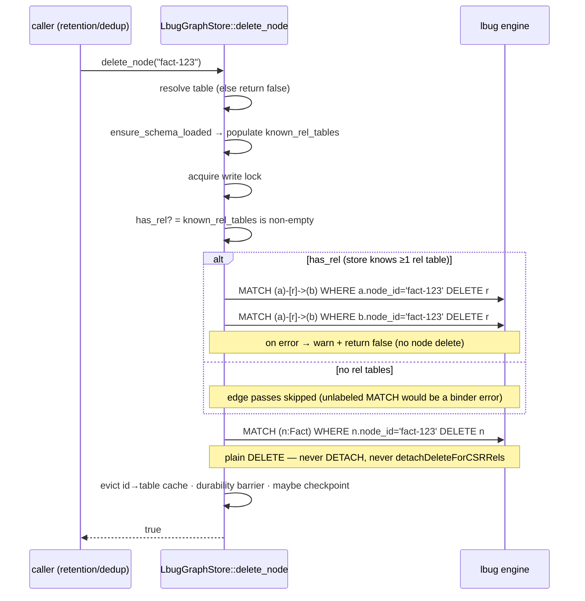

# Safe node deletion — edge-first delete that dodges the lbug 0.15.3 DETACH-DELETE CSR crash

`LbugGraphStore::delete_node` (the persistent, LadybugDB-backed `GraphStore` that
powers `CognitiveMemory::open_persistent`) deletes a node **without ever issuing a
Cypher `DETACH DELETE`**. It first removes every relationship incident to the node,
then deletes the now-isolated node with a plain `DELETE`. This sidesteps a native
`SIGSEGV` in the pinned LadybugDB engine (`lbug 0.15.3`) that crashed the engine
whenever a node with relationships stored in a CSR rel table was detach-deleted.

This page is the authoritative description of the fix for issue **#98** ("CRITICAL
native crash — daemon SEGV-crashes every ~45–90 minutes during a `DETACH DELETE`").

> **Update (#100) — deletion is now a soft delete (tombstone).** The edge-first,
> physical-`DELETE` approach described below removed the `DETACH DELETE` trigger
> (#98) but a *physical relationship delete out of a committed CSR rel group*
> (`DELETE r`) was independently shown to corrupt lbug's CSR node-group index
> (its index is set to the `UINT32_MAX` sentinel), so the next scan to touch that
> table still SEGV'd (`getGroup(UINT32_MAX)`, version-independent across lbug
> 0.15.3/0.15.4/0.17.1). To eliminate the corruption, `delete_node` and
> `delete_edge` **no longer issue any physical `DELETE`**. They mark rows deleted
> with a reserved `_deleted` tombstone column (`SET …._deleted = '1'`) — a
> property write that never mutates the CSR adjacency structure — and every read
> filters tombstoned rows out. `add_node` revives a tombstoned id (clearing the
> tombstone) so the "delete then re-add the same id" consolidation pattern still
> works. The `_deleted` column is added to every node and rel table at creation
> and back-filled on older stores via `ALTER TABLE … ADD` on reopen. Net effect:
> the observable delete/recall contract is unchanged, but the CSR corruption can
> no longer occur. (Trade-off: tombstoned rows remain physically resident until a
> future compaction/rebuild pass; the crash fix is the priority.) The sections
> below document the prior `DETACH`-avoidance design that this builds on.

- **No more native crashes.** A node that carries relationships — which, after the
  graph-enhancement work, is *most* fact and procedure nodes — can now be deleted
  without tripping the engine's buggy `detachDeleteForCSRRels` code path. The
  daemon no longer `SIGSEGV`s during retention/dedup consolidation.
- **Same public contract.** `delete_node(&node_id) -> bool` is unchanged: it still
  returns `true` when the node was removed and `false` otherwise, still evicts the
  id→table routing cache, still issues the per-write durability barrier, and still
  participates in auto-checkpointing.
- **Fail-closed.** If the incident-edge cleanup fails, `delete_node` returns `false`
  **before** touching the node, so a half-deleted, edge-orphaned node is never left
  behind.
- **Defense in depth (optional).** Where it builds cleanly, the pinned engine is
  also bumped from `=0.15.3` to the latest 0.15.x patch (`=0.15.4`), in case a patch
  independently hardens CSR deletes; otherwise the pin **stays at `=0.15.3`**. Either
  way the workaround above stands on its own and does not depend on the bump.

> **Feature gate.** Everything on this page requires the `persistent` cargo feature
> (which pulls in the `lbug` engine):
> `cargo build --features persistent` / `cargo test --features persistent`.

---

## Table of contents

1. [Why this exists (the #98 incident)](#why-this-exists-the-98-incident)
2. [Root cause](#root-cause)
3. [The fix — edge-first, no-DETACH deletion](#the-fix--edge-first-no-detach-deletion)
4. [Public API reference](#public-api-reference)
5. [Examples](#examples)
6. [Optional dependency bump — `lbug` 0.15.3 → 0.15.4](#optional-dependency-bump--lbug-0153--0154)
7. [Compatibility & guarantees](#compatibility--guarantees)
8. [Testing](#testing)

---

## Why this exists (the #98 incident)

A live consumer's daemon `SIGSEGV`-crashed on a tight cadence — every ~45–90
minutes. A symbolized core backtrace pinned the fault inside the LadybugDB engine,
during a Cypher `DETACH DELETE`:

```
getGroup(groupIdx = 4294967295 / UINT32_MAX)   -> null unique_ptr deref
  <- CSRNodeGroup::scanCommittedInMemRandom
  <- CSRNodeGroup::scan
  <- RelTableScanState::scanNext
  <- RelTable::detachDeleteForCSRRels
  <- RelTable::detachDelete
  <- SingleLabelNodeDeleteExecutor::delete_
  <- DeleteNode                              (Cypher DETACH DELETE)
  <- TaskScheduler worker
```

The crash only fired when the deleted node **had relationships** stored in a CSR
(compressed sparse row) rel table. Before the graph-enhancement features most
nodes were edgeless, so the bug was latent. Now it is routinely hit, because:

- **Facts** carry `DERIVES_FROM` (fact → episode), `SIMILAR_TO` (fact ↔ fact), and
  `SUPERSEDES` (fact → fact) edges.
- **Procedures** carry `PROCEDURE_DERIVES_FROM` edges.

`delete_node` is invoked from several consolidation/retention paths that routinely
hard-delete edge-bearing nodes:

| Caller | What it deletes |
| --- | --- |
| `cognitive_memory/dedup.rs` → `prune_semantic_memory` | archived / superseded fact nodes (which have `SUPERSEDES`/`SIMILAR_TO`/`DERIVES_FROM` edges) |
| `cognitive_memory/episodic.rs` | expired episode nodes |
| `cognitive_memory/sensory.rs` | aged-out sensory nodes |
| `cognitive_memory/working.rs` | evicted working-memory nodes |

So every consolidation cycle eventually `DETACH DELETE`d an edge-bearing node and
the engine crashed — taking the consumer's daemon down with it.

---

## Root cause

`detachDeleteForCSRRels` scans the node's CSR rel groups to delete the incident
edges as part of a single `DETACH DELETE`. In `lbug 0.15.3` that scan can compute
an invalid node-group index of `UINT32_MAX` (`4294967295`), pass it to
`getGroup`, and dereference the resulting null `unique_ptr` — an unrecoverable
native crash inside a worker thread, surfaced to the host process as `SIGSEGV`.

The trigger is specifically **`DETACH DELETE` of a node whose relationships live in
a committed CSR group**. A plain `DELETE` of a node that has *no* relationships
never enters that path. The fix therefore removes the relationships first, so the
node deletion never needs `DETACH` and never enters `detachDeleteForCSRRels`.

---

## The fix — edge-first, no-DETACH deletion

`delete_node` now performs the deletion in two ordered phases, both inside a single
critical section so no intermediate state is ever externally observable:

1. **Phase A — remove every incident relationship.** Two directed, *label-less*
   Cypher passes delete all edges touching the node, in both directions, across all
   relationship types:

   ```cypher
   -- outgoing edges (node is the source)
   MATCH (a)-[r]->(b) WHERE a.node_id = '<escaped id>' DELETE r
   -- incoming edges (node is the target)
   MATCH (a)-[r]->(b) WHERE b.node_id = '<escaped id>' DELETE r
   ```

   Two directed passes together remove outbound, inbound, self-loop, and parallel
   edges. The passes are label-less and matched purely on the globally unique
   `node_id`, mirroring the proven `query_neighbors_directed` query shape; this
   avoids a binder error that a node-labelled rel pattern would raise when the
   node's table participates in no rel table.

2. **Phase B — delete the now-isolated node with a plain `DELETE` (no `DETACH`).**

   ```cypher
   MATCH (n:<Table>) WHERE n.node_id = '<escaped id>' DELETE n
   ```

   Because Phase A has already removed every incident edge, the plain `DELETE`
   cannot fail on "node still has relationships", and — critically — never enters
   the buggy `detachDeleteForCSRRels` path.

### Control flow & guarantees

- **Routing first.** The node's table is resolved via the id→table cache (falling
  back to a catalog lookup). If the node ID is unknown (no table), `delete_node`
  returns `false` immediately.
- **Edge-pass guard.** After the schema cache is ensured loaded from the on-disk
  catalog (`ensure_schema_loaded`, which populates `known_rel_tables`), Phase A runs
  only when the store knows about at least one relationship table — the same guard
  the proven `query_neighbors` path uses. When no rel tables exist, the edge passes
  are skipped (an unlabeled rel `MATCH` would raise a binder error and there is
  nothing to delete), keeping the edgeless-node path green.
- **Fail-closed.** If either Phase A pass returns an error, `delete_node` logs a
  warning and returns `false` **without** running Phase B and **without** evicting
  the routing cache — the node is left fully intact rather than half-deleted.
- **Atomic.** Phase A, Phase B, the cache eviction, the durability barrier, and the
  auto-checkpoint bookkeeping all run under one non-reentrant lock, so a concurrent
  reader never observes a node with some-but-not-all of its edges removed.
- **Zero `DETACH`.** The implementation contains no `DETACH` keyword anywhere.
- **Injection-safe.** Every `node_id` interpolation is escaped with
  `escape_cypher`, and the node-table label is validated as a safe identifier
  before it is interpolated into the bare-label Phase B query.

### Sequence



---

## Public API reference

The trait contract is unchanged; only the persistent backend's implementation
changed.

### `GraphStore::delete_node`

```rust
/// Delete a node by ID. Returns true if the node existed.
#[must_use]
fn delete_node(&mut self, node_id: &str) -> bool;
```

**Behavior (persistent `LbugGraphStore` backend):**

| Aspect | Behavior |
| --- | --- |
| Return `true` | The node existed and was deleted, along with **all** of its incident relationships (both directions, all types, including self-loops and parallel edges). |
| Return `false` | The node ID was unknown, the incident-edge cleanup failed (node left intact), or the node `DELETE` failed. |
| Incident edges | Always removed before the node is deleted — callers do **not** need to pre-delete edges. |
| `DETACH DELETE` | Never used. |
| Durability | On success: id→table cache evicted, per-write `fsync` barrier issued (failure is logged, not fatal), and an auto-checkpoint may be triggered. |
| Concurrency | The whole operation runs under the store's write lock. |
| Idempotency | Deleting an already-absent node returns `false` and is a no-op. |

> **Note.** Like the rest of the `GraphStore` mutators, `delete_node` currently
> returns `bool` (a `FUTURE` note in the trait tracks migrating to
> `Result<bool, MemoryError>`). A `false` return that is *not* simply "node absent"
> is accompanied by a `warn!` log line containing the node ID and the underlying
> error string.

---

## Examples

### Deleting an edge-bearing fact node

```rust
use amplihack_memory::graph::protocol::GraphStore;
use amplihack_memory::graph::LbugGraphStore;

fn purge_fact(store: &mut LbugGraphStore) {
    // `fact-123` has DERIVES_FROM, SIMILAR_TO, and SUPERSEDES edges.
    // Before the fix this DETACH-deleted an edge-bearing node and crashed the engine.
    let deleted = store.delete_node("fact-123");
    assert!(deleted); // node + all incident edges removed
    assert!(store.get_node("fact-123").is_none());
}
```

No special handling is required for nodes that carry relationships — that is the
whole point. The caller does not detach or pre-delete edges; `delete_node` does it.

### Retention / dedup callers need no changes

```rust
// cognitive_memory/dedup.rs :: prune_semantic_memory (illustrative)
for fact_id in archived_and_superseded {
    // Each of these fact nodes carries SUPERSEDES / SIMILAR_TO / DERIVES_FROM edges.
    // Previously this loop periodically SIGSEGV'd the daemon; now it is safe.
    store.delete_node(&fact_id);
}
```

### Deleting an edgeless node still works

```rust
use amplihack_memory::graph::protocol::GraphStore;
use amplihack_memory::graph::LbugGraphStore;

fn purge_sensory(store: &mut LbugGraphStore) {
    // A node with no relationships: the incident-edge passes are skipped and the
    // plain DELETE removes it exactly as before.
    assert!(store.delete_node("sensory-987"));
}
```

---

## Optional dependency bump — `lbug` 0.15.3 → 0.15.4

As defense in depth, the pinned engine *may* be bumped to the latest 0.15.x patch —
**only if `=0.15.4` builds and behaves identically in this environment.** The
workaround does not require it, so the bump is explicitly conditional and the
default pin remains `=0.15.3`:

```toml
# rust/amplihack-memory/Cargo.toml — bump applied only if 0.15.4 builds cleanly
[dependencies]
lbug = { version = "=0.15.4", optional = true }   # otherwise stays "=0.15.3"
```

- The bump is **conditional and secondary.** The edge-first/no-`DETACH` workaround
  removes the crash regardless of the engine version, so `delete_node` never
  exercises `detachDeleteForCSRRels` even on `=0.15.3`. The pin is bumped only if
  `=0.15.4` builds cleanly; otherwise it **stays at `=0.15.3`** and the workaround
  stands alone. The PR records which path was taken.
- Whichever version is chosen, the pin stays **exact** (`=0.15.x`) and `Cargo.lock`
  is committed so the engine version is reproducible.
- The bump is intentionally limited to the 0.15.x line. Moving to 0.17.x is a major
  change with separate risk and is **not** part of this fix.

> **Update (#100) — the 0.17.x move now exists as a separate, coordinated
> upgrade.** The engine is being bumped `lbug 0.15.4` → `0.17.1` for both
> `amplihack-memory-lib` and Simard. The storage format goes v40 → v41 but is
> read-compatible (0.17.1 opens a v40 store in place, upgrading on first
> checkpoint), so there is no data migration. The soft-delete tombstone above
> remains the version-independent crash fix and is carried forward unchanged. See
> [`lbug_0_17_upgrade.md`](lbug_0_17_upgrade.md) for the full reference.

---

## Compatibility & guarantees

- **API-compatible.** No public signature changed; existing callers compile and
  behave identically, minus the crash.
- **Behavior-compatible.** Deleting an edgeless node is unchanged. Deleting an
  edge-bearing node now *also* removes its incident edges (it always semantically
  did via `DETACH DELETE`; it just no longer crashes doing so).
- **No data loss on failure.** A failed edge cleanup leaves the node and its edges
  fully intact and returns `false`; the routing cache is only evicted on success.
- **Durability unchanged.** The post-write `fsync` barrier and auto-checkpoint
  bookkeeping run exactly as before, on success.
- **In-memory backend unaffected.** `InMemoryGraphStore` never used the native
  engine and was never affected by this crash.

---

## Testing

The regression coverage lives in `rust/amplihack-memory/src/graph/lbug_store/tests.rs`
behind the `persistent` feature:

- **`delete_node` with committed CSR edges (the crash repro).** Opens a persistent
  store in a tempdir, adds nodes `a`, `b`, `c`, and edges `a-[LINKS]->b`,
  `b-[REL2]->a` (inbound to `a`), and `a-[SELF]->a` (self/parallel), then calls
  `checkpoint()` to materialize a **committed** CSR rel group — the exact
  precondition for `getGroup(UINT32_MAX)`. It then asserts `delete_node("a")`
  returns `true`, `get_node("a")` is `None`, `a`'s neighbors are gone, `b` has no
  remaining inbound edge from `a`, `c` is untouched, and — by virtue of the test
  process surviving — **no `SIGSEGV` occurs**. A `node_id` containing a quote and
  backslash exercises `escape_cypher` on the same path.
- **Edgeless delete (existing behavior).** The pre-existing test that deletes a node
  with no relationships is retained and still passes, proving the edge-pass guard
  keeps the edgeless path working.

Validate with the feature-gated suite (run a few times, since the original failure
was a probabilistic native crash):

```bash
cargo test  -p amplihack-memory --features persistent --lib graph::lbug_store
cargo build -p amplihack-memory --features persistent
cargo clippy -p amplihack-memory --all-targets --features persistent -- -D warnings
```

> **Pre-commit note.** The configured pre-commit hooks build with default features
> only and do not compile the `persistent` code; the explicit
> `--features persistent` commands above are the authoritative gate for this fix.
